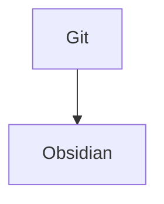

Obsidian is both a Markdown editor and a knowledge base app.
Used in the most basic way, you can edit and preview Markdown files. But its true power lies in managing a densely networked knowledge base.
[Install](https://help.obsidian.md/Getting+started/Download+and+install+Obsidian)
[Documentation](https://help.obsidian.md/Obsidian/Index)
[Markdown](https://help.obsidian.md/How+to/Format+your+notes)
[Math notation tutorial](https://math.meta.stackexchange.com/questions/5020/mathjax-basic-tutorial-and-quick-reference)
[Diagram with Mermaid](https://mermaid.js.org/syntax/classDiagram.html). [Live editor](https://mermaid-js.github.io/mermaid-live-editor/edit#pako:eNpVj80KwkAMhF8l5KRgX6AHQVv1IijobddDaNPuIvvDdotI23d3ay-aU5j5JkwGrFzNmGMbyCu4l9JCmp0oVNBdNNQ9IMu244kjGGf5PcJ-dXLQKee9tu164fczBMVwnjGGqLR9TotVfPMXyyOU4kw-Ov_4de4vN8JB6KtK5_8dFTiljqKhvKGsogAFhS-CGzQcDOk6VR9mRWJUbFhintaawlOitFPiqI_u9rYV5jH0vMHe1xS51JQ-Nos4fQAxIlOw)

## Tips & tricks
You can copy/paste any image from the clipboard directly into a note:
![[Screenshot 2022-12-06 at 8.52.34 AM.png|400]]

Embed any image using ``:

Embed a youtube video using: share->Embed->copy and paste in the note:
<iframe width="560" height="315" src="https://www.youtube.com/embed/WqKluXIra70" title="YouTube video player" frameborder="0" allow="accelerometer; autoplay; clipboard-write; encrypted-media; gyroscope; picture-in-picture" allowfullscreen></iframe>

==Highlight== by wrapping in ==
- [ ] Create a task list
- [ ] Using \-\[\] and \-\[x\]
- [ ] 
Write math formulas ([reference](https://math.meta.stackexchange.com/questions/5020/mathjax-basic-tutorial-and-quick-reference)): $e^{2i\pi} = 1$
Or: $$\begin{vmatrix}a & b\\ c & d \end{vmatrix}=ad-bc$$
Use diagrams:

